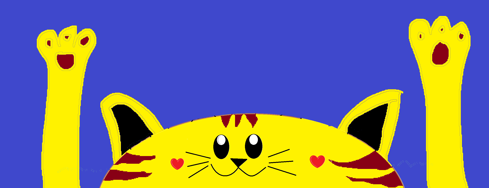

# 🐱 Gato Swing — Función de ritmo 1928

Juego de ritmo multijugador estilo **caricatura de los años 20** (rubber hose). Una cabeza de gato gigante es la *rueda* del escenario: gira, baila con sus patas de manguera, parpadea, mira los obstáculos y maúlla, mientras lanza **obstáculos 3D** que llegan **justo en el beat** de la canción, a veces de izquierda a derecha y a veces al revés. Los jugadores usan su **celular como control** y saltan al compás. **Eliminación directa**: un choque y quedas fuera; gana el último en pie (o el de más puntos si la canción termina).



## Cómo se juega

1. Abre la página en un PC/TV (la "pantalla").
2. Cada jugador escanea el QR o entra a `play.html` y escribe el código de 4 letras.
3. A cada uno le toca un personaje al azar (aguacate, lata, maní, palmera…).
4. **¡SALTA!** cuando el obstáculo llegue a tus pies. Saltar justo en el ritmo da **¡PERFECTO!** (x3) y combo.
5. Cuando aparece el letrero **¡AL REVÉS!**, la rueda cambia de sentido.

| Acción | Celular | Teclado 1 | Teclado 2 |
|---|---|---|---|
| Saltar | botón gigante | Espacio / W | ↑ |
| Maullar | 🐾 ¡MIAU! | M | N |

En la pantalla: **H** muestra los hitboxes, **Esc/P** pausa (intermedio).

## Publicar en GitHub Pages

1. Sube todo el contenido de esta carpeta a un repositorio.
2. *Settings → Pages → Deploy from branch → `main` / root*.
3. Abre `https://TU_USUARIO.github.io/TU_REPO/`.

No hay paso de compilación. Todo (Three.js, PeerJS, QR, fuentes) está en `vendor/` y `fonts/`, **sin CDN**, para que funcione detrás de proxies que bloquean CDNs o Google Fonts.

Para probar en local: `npx serve .` (o `python3 -m http.server`) y abre `http://localhost:3000`. No funciona abriendo el archivo con doble clic (`file://`).

## Red: reconexión, proxies, iPhone y Android viejos

- **WebRTC (PeerJS)**: la señalización va por `wss://` en el puerto 443 (pasa por casi cualquier proxy); los datos van P2P.
- **TURN por TCP/TLS 443** como respaldo cuando la red bloquea UDP (colegios, empresas, datos con CGNAT). El control alterna automáticamente a "solo TURN" cada 3 intentos fallidos.
- **Reconexión automática sin límite** con espera creciente. Cada celular tiene una clave guardada: si se cae, se bloquea la pantalla o cambia de WiFi a datos, **vuelve con el mismo personaje y nombre**.
- **Si la pantalla se recarga**, conserva el mismo código de sala y el mismo reparto; los celulares vuelven solos (en las pruebas: ~2 s).
- **Latidos** cada segundo en ambos sentidos; si no hay respuesta en 5–6 s se reconecta.
- **Compensación de lag**: el celular envía la hora exacta del toque; la pantalla sincroniza relojes (tipo NTP) y aplica el salto en el momento real (hasta 200 ms). Si un choque ocurre dentro de esa ventana, se re-simula antes de eliminar a nadie.
- **iPhone**: sin zoom por doble toque, alto real de pantalla (`--vh`), áreas seguras (notch), `touchstart` sin retraso, Wake Lock para que no se apague la pantalla, reconexión al volver a la pestaña (`visibilitychange`, `pageshow`).
- **Android viejo**: el control (`play.html` + `js/play.js`) está escrito en **ES5** y PeerJS se re-compiló a ES2017 (sin `?.`). Si el navegador no soporta WebRTC, lo dice claramente.
- **Navegadores dentro de apps** (WhatsApp, Instagram, Facebook): se detectan y se sugiere abrir en Chrome/Safari.
- **Diagnóstico** en el lobby: muestra si hay conexión local, STUN y TURN.

### Configurar un TURN propio (recomendado para redes con proxy)

Edita `config.js`:

```js
iceServers: [
  { urls: ['stun:stun.l.google.com:19302'] },
  { urls: ['turn:TU_SERVIDOR:3478', 'turns:TU_SERVIDOR:443?transport=tcp'], username: 'usuario', credential: 'clave' },
],
// o credenciales temporales de Metered Open Relay (20 GB/mes gratis):
meteredTurn: { appName: 'tuapp', apiKey: 'TU_API_KEY' },
```

El TURN público incluido (`openrelay.metered.ca`) es "de mejor esfuerzo": puede estar saturado. También puedes usar tu propio servidor de señalización PeerJS (`peer: { host, port, path, secure }`).

## Ritmo y obstáculos

- Al cargar una canción se analiza en un *Web Worker*: flujo espectral → tempo por autocorrelación → seguimiento de beats por programación dinámica → fuerza/energía por beat y tiempo 1 del compás.
- La partitura coloca cada llegada **en un beat**, elige los golpes más fuertes, sube la densidad con la energía de la canción y cambia de sentido en inicios de frase.
- Los jugadores se ubican sobre la cabeza separados por **una fracción musical** (1, ½ o ¼ de beat) de recorrido del obstáculo: a cada uno le llega su obstáculo justo en un tiempo o subdivisión.
- Puedes cargar **cualquier MP3** desde el lobby; el botón ↺ vuelve a la canción original.
- *Ajustes → Retraso del audio*: compensa parlantes Bluetooth o TV con retraso.

### Hitboxes

Cada obstáculo es una unión de primitivas (caja, círculo, triángulo). **Las mismas primitivas construyen la malla 3D y la colisión**, así que lo que ves es lo que golpea. La colisión se calcula a 240 Hz. Antes de aceptar un obstáculo, el generador **prueba todos los momentos de despegue posibles** con la física real y exige una ventana de salto mínima (Fácil 200 ms, Normal 150 ms, Difícil 110 ms); si no se puede saltar, lo encoge. El hitbox del jugador es un poco más angosto que el dibujo (más justo para el jugador).

```bash
# test de partitura + hitboxes (necesita ffmpeg para convertir el audio)
ffmpeg -i assets/audio/ww.mp3 -ac 1 -ar 11025 -f f32le /tmp/ww.f32
npm test -- /tmp/ww.f32
```

Hay también un test de red de punta a punta (`tests/red.e2e.cjs`: dos celulares, reconexión, recarga del host y saltos con lag real).

El test de partitura verifica en las 3 dificultades: que todo obstáculo tenga ventana de salto, que un jugador que salta perfecto sobreviva **toda la canción en cualquier posición** del grupo, que sin saltar se muera, y que cada llegada caiga en el ritmo.

## Personajes

Los modelos GLB no traen esqueleto: al cargarse se les quitan las piernas/brazos finitos y se les ponen **extremidades de manguera** con guantes blancos y zapatos, animadas por código (caminar, correr, saltar con *squash & stretch*, bailar al beat en el lobby y salir volando en K.O.).

**Agregar un personaje:** copia `nuevo.glb` en `assets/characters/`, agrégalo a `CHARACTERS` en `js/host/characters.js` y genera su retrato abriendo `tools/retratos.html` desde el servidor (guárdalo en `assets/portraits/nuevo.png`).

## Estructura

```
index.html            pantalla (host): lobby, juego, resultados
play.html             control del celular
config.js             red (STUN/TURN/servidor PeerJS)
js/host/main.js       arranque + interfaz
js/host/game.js       lógica del juego, física, bots, lag
js/host/net.js        red del host (PeerJS + BroadcastChannel)
js/host/cat.js        el Gato-Rueda (cara 2D, orejas, brazos que bailan)
js/host/characters.js personajes 3D + extremidades de manguera
js/host/obstacles3d.js mallas de obstáculos desde los hitboxes
js/host/physics.js    física y colisiones compartidas
js/host/catalog.js    tipos de obstáculo (perfiles de colisión)
js/host/chart.js      generador de partitura rítmica
js/host/beat-analysis.js / beat-worker.js  detección de tempo/beats
js/host/fx.js         placas de nombre, efectos de película, iris
js/play.js            control (ES5)
tests/chart.test.mjs  test de ritmo + hitboxes
tools/retratos.html   generador de retratos
```

Ver [CREDITS.md](CREDITS.md) para licencias.
